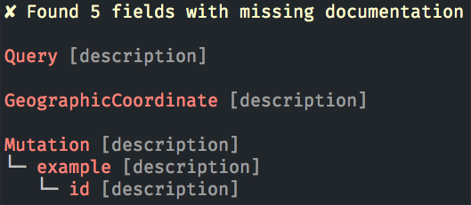

GraphQL Documentation Check
========

Quickly find any missing documentation in your GraphQL API using introspection. Performs inspections remotely, without any need to access code.

## Installation

    npm install -g graphql-doc-check

## Usage

Calling `graphql-doc-check` without any arguments will assume that your GraphQL
API is running at `http://localhost:80/graphql`.

    $ graphql-doc-check

Alternatively, you can pass a URL to check.

    $ graphql-doc-check https://example.com/graph

Results are shown in a tree structure with fields missing documentation in red.

    Type1
    ├─ field1 [missing | properties]
    │  ├─ arg1
    │  ├─ arg2
    └─ field2
       └─ arg3 [description]

## License

Copyright (c) 2016, Jordan Adams

Permission to use, copy, modify, and/or distribute this software for any purpose with or without fee is hereby granted, provided that the above copyright notice and this permission notice appear in all copies.

THE SOFTWARE IS PROVIDED "AS IS" AND THE AUTHOR DISCLAIMS ALL WARRANTIES WITH REGARD TO THIS SOFTWARE INCLUDING ALL IMPLIED WARRANTIES OF MERCHANTABILITY AND FITNESS. IN NO EVENT SHALL THE AUTHOR BE LIABLE FOR ANY SPECIAL, DIRECT, INDIRECT, OR CONSEQUENTIAL DAMAGES OR ANY DAMAGES WHATSOEVER RESULTING FROM LOSS OF USE, DATA OR PROFITS, WHETHER IN AN ACTION OF CONTRACT, NEGLIGENCE OR OTHER TORTIOUS ACTION, ARISING OUT OF OR IN CONNECTION WITH THE USE OR PERFORMANCE OF THIS SOFTWARE.
